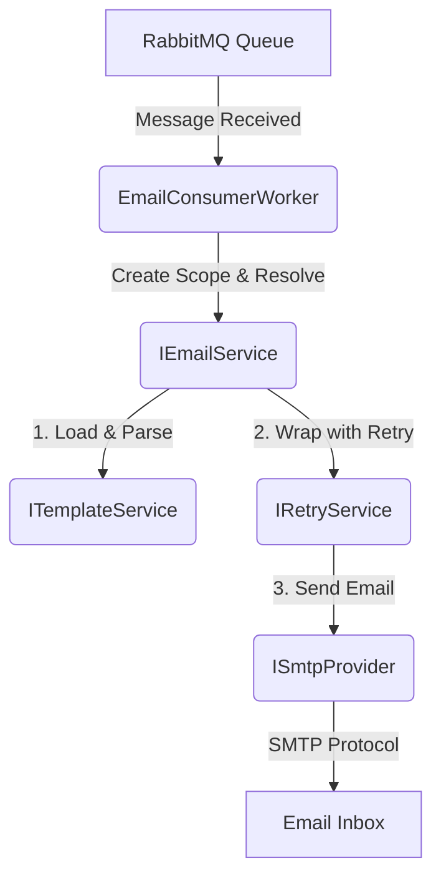

# Technical Documentation: SkillBuddy Email Worker

This document provides a beginner-friendly overview of how the Email Worker service functions, its internal workflow, and the purpose of each component.

## 1. Working Flow

The service acts as a "Consumer." It waits for messages to arrive in a queue (RabbitMQ) and processes them into actual emails sent via SMTP.

### High-Level Workflow


### Detailed Execution Steps:
1.  **Subscription**: The `EmailConsumerWorker` connects to RabbitMQ and listens to the defined `email_queue`.
2.  **Reception**: A JSON message arrives (e.g., `{ "To": "user@example.com", "TemplateName": "Welcome" }`).
3.  **Scoped Resolution**: Since the worker runs as a Singleton, it creates a temporary *scope* to use transient services for each message.
4.  **Processing**:
    -   `TemplateService` loads the HTML file and replaces `{{Placeholder}}` tags with real data.
    -   `EmailService` prepares the subject and body.
5.  **Resilience**: The `RetryService` (powered by Polly) watches the attempt. If the SMTP server is temporarily down, it waits and tries again (Exponential Backoff).
6.  **Delivery**: `SmtpProvider` uses the MailKit library to log in to the SMTP server and hand off the message.
7.  **Acknowledgment (Ack)**: If successful, the worker tells RabbitMQ "I'm done, delete the message." If it fails permanently, it tells RabbitMQ "Something went wrong" (Nack).

---

## 2. Component Directory ("Which class/Why?")

| Category | Class / Interface | Why use it? (Purpose) |
| :--- | :--- | :--- |
| **Worker** | `EmailConsumerWorker` | The "Brain" that stays alive in the background. It listens to RabbitMQ and starts the processing loop. |
| **Core Logic** | `IEmailService` | The "Orchestrator." It doesn't know *how* to send mail or *how* to parse templates; it just coordinates the two. |
| **Templates** | `ITemplateService` | Handles the "Design." It looks for `.html` files in the `Templates` folder and swaps out variables (like `{{Name}}`). |
| **Delivery** | `ISmtpProvider` | The "Mailman." It contains the specific technical code to talk to an SMTP server (using MailKit). |
| **Resilience** | `IRetryService` | The "Safety Net." It uses **Polly** to handle "What if the internet cuts out for 5 seconds?" by retrying automatically. |
| **Settings** | `EmailOptions` | Holds your SMTP server, port, and password. Loaded safely from `appsettings.json`. |
| **Settings** | `RabbitMqOptions` | Holds your RabbitMQ host and queue name. Loaded safely from `appsettings.json`. |
| **Setup** | `Program.cs` | The "Electrician." It wires all these classes together (Dependency Injection) so they can talk to each other. |

---

## 3. Data Structure (EmailRequestDto)

When sending a message to the queue, it must follow this JSON format:

```json
{
  "To": "recipient@example.com",
  "TemplateName": "Welcome.html",
  "Placeholders": {
    "UserName": "Alice",
    "CurrentYear": "2024"
  }
}
```

> [!TIP]
> **Why use Interfaces (the "I" prefix)?**
> We use interfaces like `IEmailService` instead of classes directly so that we can easily swap implementations later (e.g., switching from SMTP to SendGrid) without changing the main Worker code.
